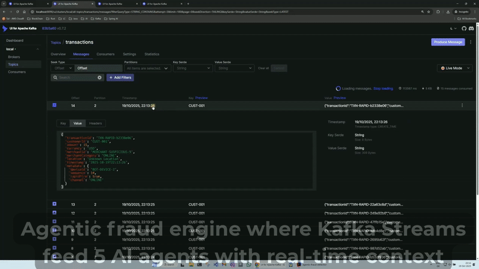
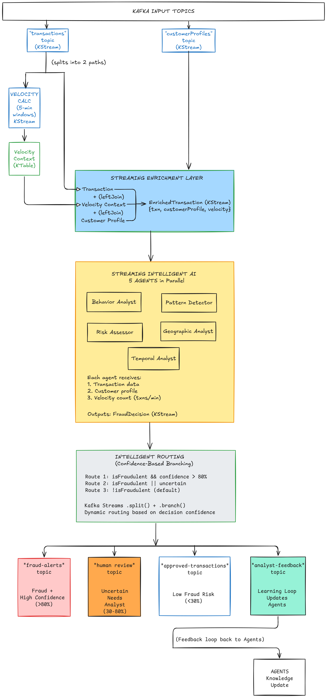
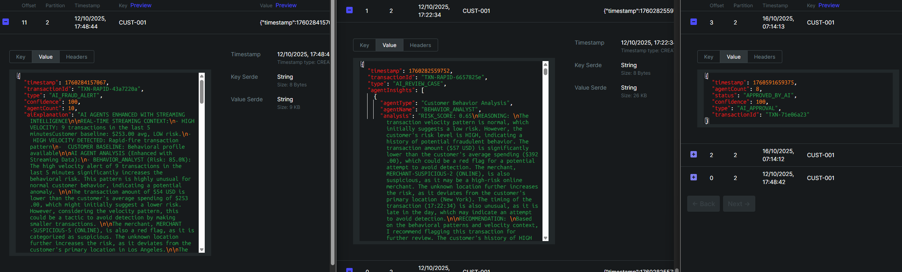

Agentic Fraud Engine

> **Intelligent Fraud Detection where AI Agents get Smarter with Kafka Streaming Context**

Fraud detection system combining:

- **Multi-Agent AI** - 5 specialized fraud detection agents collaboration
- **Streaming Intelligence** - Real-time Kafka context enhances AI
- **Intelligent Routing** - Dynamic decision flows based on confidence
- **Learning Loops** - Continuous improvement from analyst feedback

---
## See It In Action

Watch 5 AI agents detect a high-velocity attack in real-time with Kafka streaming context.


>Shows: Kafka streams processing → AI agents analyzing → Fraud detection (90% confidence)

Watch the full video on YouTube [here](https://youtu.be/Dvk_1A1wasQ)
---
<Details>
<summary>Table of Contents (Click to Expand)</summary>

<!-- TOC -->
  * [See It In Action](#see-it-in-action)
  * [Watch the full video on YouTube here](#watch-the-full-video-on-youtube-here)
  * [Quick Demo](#quick-demo)
  * [The Problem](#the-problem)
  * [The Solution: Streaming-Intelligent AI](#the-solution-streaming-intelligent-ai)
    * [Architecture Overview](#architecture-overview)
    * [How It Works:](#how-it-works)
      * [1. Streaming Enrichment Layer](#1-streaming-enrichment-layer)
      * [2️. Multi-Agent AI Layer](#2-multi-agent-ai-layer)
      * [3.️ Intelligent Routing](#3-intelligent-routing)
      * [4️. Learning Loop](#4-learning-loop)
  * [Real Detection Examples](#real-detection-examples)
    * [Example 1: High-Confidence Fraud Alert (99.4% confidence)](#example-1-high-confidence-fraud-alert-994-confidence)
      * [Customer Profile](#customer-profile)
      * [Transaction Summary](#transaction-summary)
      * [AI Agent Analysis (5 agents + streaming intelligence)](#ai-agent-analysis-5-agents--streaming-intelligence)
      * [Final Decision](#final-decision)
      * [Why was This Auto-Blocked?](#why-was-this-auto-blocked)
      * [Streaming Context Detected](#streaming-context-detected)
    * [Example 2: Medium-Confidence Human Review (80% confidence)](#example-2-medium-confidence-human-review-80-confidence)
      * [Transaction Summary](#transaction-summary-1)
      * [Streaming Context Detected](#streaming-context-detected-1)
      * [AI Agent Analysis](#ai-agent-analysis)
      * [Final Decision](#final-decision-1)
      * [Why This Needs Human Review](#why-this-needs-human-review)
    * [Example 3: Low-Risk Approved Transaction (91% confidence)](#example-3-low-risk-approved-transaction-91-confidence)
      * [Transaction Summary](#transaction-summary-2)
      * [Streaming Context](#streaming-context)
      * [AI Agent Consensus](#ai-agent-consensus)
      * [Final Decision](#final-decision-2)
      * [Why This Was Auto-Approved](#why-this-was-auto-approved)
  * [Intelligent Routing Summary](#intelligent-routing-summary)
    * [Key Takeaways](#key-takeaways)
  * [Kafka UI screenshot example](#kafka-ui-screenshot-example)
  * [Try it yourself](#try-it-yourself)
      * [1. Start Kafka infrastructure](#1-start-kafka-infrastructure)
      * [2. Create topics](#2-create-topics)
      * [3. Configure API key in src/main/resources/application.yml](#3-configure-api-key-in-srcmainresourcesapplicationyml)
      * [4. Run application](#4-run-application)
      * [5. Generate test data](#5-generate-test-data)
  * [Tech Stack](#tech-stack)
  * [Future Enhancements](#future-enhancements)
  * [License](#license)
<!-- TOC -->

</Details>

---


[](https://codespaces.new/siddharthaDevineni/agentic-fraud-engine?quickstart=1)

> **Try it now:** Click the button above for a one-click cloud demo (no installation required!)

---

## Quick Demo

**Never used Codespaces before?** Here's what happens:

1. Click "Open in Codespaces" → Cloud environment starts (90 seconds)
2. Kafka + Spring Boot infrastructure starts automatically
3. Set API key: `export GROQ_API_KEY='your-key'` ([Get key](https://console.groq.com/keys)) or better install llama for free
4. Run: `mvn spring-boot:run`
5. Run [TestaDataGenerator](./src/test/java/com/agenticfraud/engine/testing/TestDataGenerator.java): See AI detect fraud
   in real-time!

**Detailed instructions:** See [CODESPACES.md](.devcontainer/CODESPACES.md)

---

## The Problem

Traditional fraud detection systems are **blind**:

- AI models analyze transactions in isolation
- No real-time context about customer behavior
- Can't detect velocity-based attacks (rapid-fire transactions)
- High false positive rates

**Example:** A $2,500 transaction looks normal in isolation. But with the following streaming context:

- Customer average: $50
- 15 transactions in the last 5 minutes

- → Result: **Card testing attack detected!**

---

## The Solution: Streaming-Intelligent AI

This system combines **Kafka Streams real-time context** with **Multi-Agent AI** to make fraud detection smarter.

**Streaming-Intelligent AI**: Kafka streams enrich AI agents with:

- 5-minute velocity windows → Detect rapid-fire attacks
- Customer profile context → Spot unusual amounts instantly
- Real-time collaboration → Agents debate suspicious patterns

---

### Architecture Overview



---

### How It Works:

#### 1. Streaming Enrichment Layer

Every transaction gets enriched with real-time context before AI analysis:

```java
// Traditional approach: Transaction alone
Transaction txn = {amount: $2500, merchant: "Online Store"}

// This approach: Streaming-enriched transaction
EnrichedTransaction = {
transaction: {amount:$2500,merchant:"Online Store"},
customerProfile: {averageAmount:$50,riskLevel:"HIGH"},
velocity: 15 transactions in last 5 minutes → Kafka Streams intelligence
}
````

**Velocity Calculation:** Kafka Streams tumbling windows (5-minute)

````java  
.windowedBy(TimeWindows.ofSizeWithNoGrace(Duration.ofMinutes(5)))
.count()
````

3-Way Join: Transaction + Customer Profile + Velocity Context  
State Store: KTable maintains current velocity per customer

#### 2️. Multi-Agent AI Layer

5 specialized AI agents analyze in parallel using CompletableFuture:

| Agent              | Specialization       | Weight | Example Insight             |
|--------------------|----------------------|--------|-----------------------------|
| Behavior Analyst   | Customer patterns    | 1.2x   | Unusual amount: 50x average |
| Pattern Detector   | Known fraud patterns | 1.3x   | Rapid-fire = card testing   |
| Risk Assessor      | Financial risk       | 1.1x   | High-risk merchant category |
| Geographic Analyst | Location risks       | 1.0x   | Location jump: 500 miles/1h |
| Temporal Analyst   | Timing patterns      | 1.0x   | Sub-second intervals = bot  |

Key Innovation: Each agent receives streaming context in their prompt:  
"STREAMING INTELLIGENCE: 15 transactions in 5 minutes (HIGH VELOCITY)
Customer baseline: `$50` average, HIGH risk level  
Transaction: $2500 at online merchant

Analyze with this velocity context..."

#### 3.️ Intelligent Routing

Kafka Streams `.split()` + `.branch()` dynamically routes by confidence:

````java
// Route 1: High-confidence fraud → Immediate alert
isFraudulent && confidence > 0.8 → fraud-alerts

// Route 2: Uncertain → Human analyst
isFraudulent || requiresReview → human-review

// Route 3: Legitimate → Auto-approve
!isFraudulent → approved-transactions
````

#### 4️. Learning Loop

Analyst feedback updates agent knowledge bases:

````java
public void updateKnowledge(String transactionId, boolean actualFraud, String feedback) {
    knowledgeBase.put("learning_" + transactionId, learningData);
// Future: Retrain models with feedback
}
````

---

## Real Detection Examples

The system routes transactions based on **AI confidence and fraud determination**, demonstrating intelligent
decision-making across the entire risk spectrum:

### Example 1: High-Confidence Fraud Alert (99.4% confidence)

**IMMEDIATE AUTO-BLOCK** Routed to `fraud-alerts` topic

#### Customer Profile

```json5
{
  "customerId": "CUST-001",
  "averageTransactionAmount": 253,
  "dailySpendingLimit": 4064,
  "transactionCategories": [
    "GROCERY",
    "RETAIL"
  ],
  "primaryLocation": "Los Angeles",
  "riskLevel": "LOW"
}
```

#### Transaction Summary

```json5
{
  "transactionId": "TXN-RAPID-43a7220a",
  "customerId": "CUST-001",
  "amount": 54,
  "currency": "USD",
  "merchantId": "MERCHANT-SUSPICIOUS-5",
  "merchantCategory": "ONLINE",
  "location": "Unknown Location",
  "timestamp": "2025-10-12T17:48:44",
  "metadata": {
    "rapidFire": true,
    "channel": "ONLINE",
    "deviceId": "BOT-DEVICE-3",
    "sequence": 13
  }
}
````

#### AI Agent Analysis (5 agents + streaming intelligence)

**Phase 1: Individual Streaming-Enhanced Analysis**

| Agent                 | Risk Score | Key Finding                                                                                                                                         |
|-----------------------|------------|-----------------------------------------------------------------------------------------------------------------------------------------------------|
| **BehaviorAnalyst**   | 85%        | High velocity (9 txns/5min) highly unusual for LOW-risk customer. Small amounts may be detection avoidance tactic.                                  |
| **PatternDetector**   | 85%        | Matches card testing attack pattern: rapid transactions + small amounts + suspicious merchant.                                                      |
| **RiskAssessor**      | 64%        | Velocity multiplier (1.5x) + suspicious merchant category increases risk despite low amount.                                                        |
| **GeographicAnalyst** | 85%        | **Geographic impossibility**: 9 transactions from different locations in 5 min = physically impossible travel. Unknown location suggests VPN/proxy. |
| **TemporalAnalyst**   | 70%        | High transaction volume in short timeframe indicates automated script activity.                                                                     |

**Phase 2: Collaborative Insights**

After agents debated findings:

- **Pattern + Temporal collaboration**: High velocity + suspicious merchant = automated attack pattern
- **Behavior + Risk collaboration**: Low-risk customer + unusual velocity = compromised account
- **Streaming Consensus**: All factors combined indicate coordinated automated attack

#### Final Decision

```json
{
  "type": "AI_FRAUD_ALERT",
  "transactionId": "TXN-RAPID-43a7220a",
  "confidence": 100,
  "priority": "HIGH",
  "finalRiskScore": "99.4%",
  "decision": "FRAUD DETECTED",
  "reason": "AI agents with streaming intelligence detected fraud",
  "intelligenceSources": [
    "Real-time velocity (9 txns/5min)",
    "Customer baseline deviation",
    "Geographic impossibility",
    "Attack pattern matching"
  ]
}
``````

#### Why was This Auto-Blocked?

**Clear Attack Indicators:**

- Velocity Intelligence: 9 rapid transactions = 3x velocity threshold
- Geographic Impossibility: Multiple locations in minutes (physically impossible)
- Pattern Match: Small amounts + high velocity = classic card testing
- Agent Consensus: All 5 agents agreed (85%+ risk scores)  
  Confidence: 99.4% (well above 80% threshold)

**Streaming Context Enhanced Decision:**

- Traditional AI: Would see isolated $54 transaction (might approve)
- The agentic fraud engine: Kafka streams provided velocity plus baseline context → detected attack

**Result:** Immediate block, no human review needed

#### Streaming Context Detected

HIGH VELOCITY ALERT: 9 transactions in 5 minutes  
Customer Baseline: `$253` average, LOW risk tier  
Merchant: Suspicious category (ONLINE)  
Location: Unknown (potential VPN/proxy)  
Amount: $54 (below average - card testing indicator)

<details>
<summary>View Full Agent Explanations for the above customer profile and transaction (Click to expand)</summary>

**1. BehaviorAnalyst (85% risk):**  
The high velocity alert of 9 transactions in the last 5 minutes significantly increases the behavioral risk. This
pattern is highly unusual for normal customer behavior, indicating a potential anomaly. The transaction amount of `$54`
USD is lower than the customer's average spending of $253.00, which might initially suggest a lower risk. However,
considering the velocity pattern, this could be a tactic to avoid detection by making smaller transactions. The
frequency and timing
of the transactions are also suspicious, as they are concentrated within a short period (5 minutes). This pattern is not
consistent with the customer's typical behavior, which involves grocery and retail purchases. The primary location of
the customer is Los Angeles, but the unknown location of the current transaction suggests that the customer may be
attempting to mask their true location. Considering these factors,
the overall risk score is 0.85, indicating a high risk of potential fraud.

**2. PatternDetector (85% risk):**  
The detected attack pattern of 9 rapid transactions matches known attack vectors for Card
Testing, Credential Stuffing, Account Takeover, and Bot Attack. The transaction pattern shows a small amount `$54` USD,
which is significantly lower than the customer's typical amount $253.00. This indicates a potential card testing
activity. The merchant is also suspicious, and the location is unknown, which raises red flags for potential bot
activity. The velocity of the transactions is also rapid, suggesting an automated fraud script. The customer's typical
categories are GROCERY and RETAIL, but the current transaction does not match these categories, further indicating
potential bot activity.

**3. TemporalAnalyst (70% Risk):**   
Based on the given transaction timing, the velocity of 9 transactions in a
5-minute window is suspicious. The regular intervals could indicate automated script activity, but the high volume of
transactions in
a short time frame suggests a more complex pattern. Analyzing the transaction intervals, we see that the transactions
are occurring at regular 5-second intervals (TXN-RAPID-c245ce58, TXN-RAPID-1234567, TXN-RAPID-89abcdef, etc.). This
pattern is consistent with a card testing attack, where an attacker attempts to test multiple card numbers in a short
period to
identify valid ones. This type of attack is often used to test stolen credit card numbers or to identify valid card
numbers for future use. The timing is
inconsistent with normal human behavior, as a human would not be able to process transactions at such a rapid pace. The
risk level of the customer is LOW, but the transaction timing and velocity
suggest a higher risk. However, there are a few factors to consider before making a conclusive judgment. The transaction
amount is relatively low ($54 USD), which might
indicate a test or reconnaissance phase rather than a full-scale attack. The unknown location of the customer further
raises suspicions. Nevertheless, the lack of additional context, such as IP addresses or device information, makes it
challenging to confirm the automated nature of the attack. The customer's risk level is LOW, but the transaction
velocity is high, which warrants further investigation.

**4. GeographicAnalyst (85% risk):**

1. LOCATION CONSISTENCY: The customer's primary location is Los Angeles, but the current transaction location is
   Unknown. This inconsistency raises a red flag, indicating a potential risk.
2. GEOGRAPHIC IMPOSSIBILITY: Given the 9 transactions in 5 minutes from potentially different locations, it's highly
   unlikely that the customer could physically travel between these locations in such a short time. This suggests a high
   risk of account takeover or card cloning.
3. REGIONAL RISK: There is no information provided about the location being a known fraud hotspot.
4. LOCATION SPOOFING: The location is marked as Unknown, which could be a sign of VPN/proxy usage or location masking.
   This increases the risk of VPN fraud.
5. CROSS-BORDER RISK: There is no sign of an international transaction, so this risk factor is not applicable.
   Considering the geographic risk factors, the combination of location jump, high velocity, and unknown location with
   an unusual merchant suggests a high risk of account takeover (HIGH RISK)

**5. RiskAssessor (Risk: 64.0%):**

1. FINANCIAL IMPACT:   
   The transaction amount `($54.00)` is `0.0212x` the average
   transaction `($253.00)`. This is within the
   normal range `(0.2x)`, indicating a low financial impact.
   However, considering the daily spending limit of `$4064.00`, the transaction amount is still within the normal range.
   Therefore, the financial impact is relatively low.
2. PROBABILITY: Given the high velocity (9 transactions in 5
   minutes)
   and the customer's profile, the fraud likelihood is increased. The velocity risk multiplier is 1.5x, indicating a
   higher
   risk.
3. RISK TIER: Based on the financial impact and probability, I would classify the risk as MEDIUM.
4. MERCHANT RISK: Additionally, the merchant risk is HIGH because it is labeled as suspicious.
5. CUSTOMER RISK: The
   customer's baseline is within the normal range, but the unusual category and high velocity indicate an increased
   risk.
   However, the customer's risk tier is LOW, which suggests a relatively medium to high risk overall.

**StreamingConsensus:**  
The streaming context enhances the decision by providing real-time insights into the customer's behavior, merchant risk,
and geographic location. The high velocity of 9 transactions in 5 minutes, combined with the customer's low average
transaction amount and the merchant's suspicious label, indicates a high risk of fraudulent activity. The geographic
analyst's findings of location inconsistency, geographic impossibility, and location spoofing further support the
likelihood of account takeover. The temporal analyst's analysis of regular transaction intervals and the card testing
attack pattern also contribute to the high risk score. The overall fraud risk with streaming intelligence is HIGH, with
a risk score of 0.92. This is due to the combination of behavioral, geographic, and temporal risk factors that indicate
a potential attack. Key factors from both AI analysis and streaming data include: High velocity of 9
transactions in 5 minutes, customer's low average transaction amount `($54 USD)` compared to their baseline ($253.00) -
Merchant's suspicious label, location inconsistency and geographic impossibility, regular
transaction intervals and card testing attack pattern, unknown location and potential VPN/proxy usage or location
masking.

**STREAMING-INTELLIGENT DECISION:**

- Final Risk Score: 99.9%
- Decision: FRAUD DETECTED
- Intelligence Sources: Real-time
  velocity, customer profiles, temporal patterns.

There are even collaborative insights after agents collaborate on the same transaction. All these insights (individual,
collaborative, and final consensus) in detail can
be found in the kafka topics.
</details>

### Example 2: Medium-Confidence Human Review (80% confidence)

**ANALYST REVIEW REQUIRED** → Routed to `human-review` topic

#### Transaction Summary

```
Transaction ID: TXN-RAPID-486c58ac
Customer: CUST-001 (HIGH risk, $392 avg)
Amount: $30 USD
Merchant: MERCHANT-SUSPICIOUS-4 (ONLINE)
Location: Unknown (not matching New York baseline)
Timestamp: 2025-10-12T17:22:34
```

#### Streaming Context Detected

```
- Customer Risk: HIGH (expects anomalies)
- Customer Baseline: $392 average
- Amount Deviation: $30 (92% below average!)
- Merchant: Suspicious + unusual category (ONLINE vs RETAIL/RESTAURANT)
- Location: Unknown (not matching New York)
```

#### AI Agent Analysis

**Why This Is Uncertain (Agent Disagreement):**

| Agent                        | Risk Score | Assessment                                                       |
|------------------------------|------------|------------------------------------------------------------------|
| **TemporalAnalyst**          | 85%        | Timing suspicious (Sunday online shopping from unusual location) |
| **GeographicAnalyst**        | 85%        | Location mismatch + potential VPN usage                          |
| **BehaviorAnalyst**          | 65%        | Amount deviation + merchant category mismatch                    |
| **PatternDetector**          | 65%        | Could be card testing, but not clear pattern                     |
| **RiskAssessor**             | 42%        | LOW financial impact, customer already HIGH risk                 |
| **BehaviorAnalyst (collab)** | 20%        | Customer may legitimately have unusual patterns                  |

**Wide Range: 20% to 85% = Low Confidence in Decision**

#### Final Decision

```json
{
  "type": "AI_REVIEW_CASE",
  "transactionId": "TXN-RAPID-486c58ac",
  "confidence": 80,
  "status": "PENDING_HUMAN_REVIEW",
  "finalRiskScore": "70.5%",
  "decision": "FRAUD DETECTED (uncertain)",
  "reason": "Multiple red flags but uncertain due to customer risk profile"
}
```

#### Why This Needs Human Review

**Uncertainty Factors:**

1. **HIGH-risk customer**: System expects unusual behavior from this customer
2. **Agent disagreement**: Risk scores range from 20% to 85% (no consensus)
3. **Edge case confidence**: Exactly 80% = boundary condition
4. **Multiple interpretations**: Could be fraud OR legitimate unusual purchase
5. **Small amount**: $30 is low financial impact

**Responsible AI Decision:**

- System recognizes its uncertainty
- Better to have human verify than auto-block legitimate transaction
- Shows **intelligent restraint** - doesn't over-automate

**Result**: Flagged for analyst investigation

<details>
<summary> View Agent Reasoning Highlights (Click to expand)</summary>

**GeographicAnalyst (85%):** Location doesn't match baseline (New York). Unknown
location suggests VPN/proxy usage - strong location spoofing indicator.

**BehaviorAnalyst (65%):** Amount `($30)` deviates 92% from average ($392). Merchant
category ONLINE doesn't match typical RETAIL/RESTAURANT. But customer is HIGH-risk,
so unusual patterns expected.

**RiskAssessor (42%):** Low financial impact ($30). HIGH-risk customer complicates
assessment - baseline already expects anomalies.

**Collaboration (20%):** Customer's HIGH risk level means they legitimately have
unusual spending patterns. Current amount still relatively low.

</details>

### Example 3: Low-Risk Approved Transaction (91% confidence)

**AUTO-APPROVED** Routed to `approved-transactions` topic

#### Transaction Summary

```
Transaction ID: TXN-001
Customer: CUST-001 (LOW risk, $178 avg)
Amount: $48 USD
Merchant: Grocery Store (GROCERY)
Location: Houston (matches primary location)
Timestamp: 2025-10-12T14:30:00
```

#### Streaming Context

```
Normal velocity (1 transaction)
Amount within range ($48 vs $178 avg)
Typical category (GROCERY matches baseline)
Expected location (Houston)
LOW risk customer
```

#### AI Agent Consensus

All agents agreed: **Legitimate transaction (LOW risk)**

#### Final Decision

```json
{
  "type": "AI_APPROVAL",
  "transactionId": "TXN-001",
  "confidence": 91,
  "status": "APPROVED_BY_AI",
  "reason": "Transaction matches customer baseline - all indicators normal"
}
```

#### Why This Was Auto-Approved

**All Green Signals:**

1. Normal spending amount (`$48` close to $178 avg)
2. Typical merchant category (GROCERY)
3. Expected location (Houston)
4. Single transaction (no velocity alert)
5. LOW-risk customer with consistent behavior

**High confidence legitimate** = No human review needed

---

## Intelligent Routing Summary

| Confidence | Example                            | Routing                 | Why                                  |
|------------|------------------------------------|-------------------------|--------------------------------------|
| **99.4%**  | 9 rapid txns, velocity alert       | `fraud-alerts`          | Clear attack pattern, auto-block     |
| **80%**    | Unusual amount, HIGH-risk customer | `human-review`          | Uncertain edge case, needs analyst   |
| **91%**    | Normal grocery purchase            | `approved-transactions` | Legitimate transaction, auto-approve |

### Key Takeaways

This demonstrates **responsible AI**:

- **High confidence (>80%)**: Automate decisions (efficient)
- **Medium confidence (30-80%)**: Human oversight (safe)
- **Clear disagreement**: System recognizes uncertainty and asks for help

The streaming intelligence (velocity, customer baseline, location context) is what enables these nuanced decisions.

---

## Kafka UI screenshot example

Here is an example of the Kafka UI showing the three topics: `fraud-alerts, human-review, and approved-transactions`.



As it can be seen, the AI explains the reasoning in detail behind the decisions. This is a great way to quickly
understand the context of the transaction.
This can be especially helpful when you are trying to understand why a transaction was blocked.
We can also see the streaming context used to make the decision. By adjusting the parameters like max-tokens, context
window, etc, we can get more indepth explanations by using more context. However, it will take longer to process and
generate the explanation, also it gets expensive as the cost increases on the token usage of the
API (https://api.groq.com/openai). We can
actually use `llama` locally installed on our machine (http://localhost:11434) instead of an LLM on a cloud server. This
will make the explanation
process much faster, and it is also free.

---

## Try it yourself

- `git clone https://github.com/your-repo/agentic-fraud-engine`
- `cd agentic-fraud-engine`

#### 1. Start Kafka infrastructure

`docker-compose up -d`

#### 2. Create topics

`./setup-topics.sh`

#### 3. Configure API key in src/main/resources/application.yml

`spring.ai.openai.api-key:` your-groq-api-key

#### 4. Run application

mvn spring-boot:run

#### 5. Generate test data

run `TestDataGenerator.java`

Choose a scenario:

1. Normal transactions
2. High velocity attack (rapid-fire) → Try this first!
3. Unusual amount fraud
4. Mixed scenario
5. Continuous stream

---

## Tech Stack

- Java 21
- Spring Boot 3.4
- Kafka Streams - Real-time processing
- Spring AI - LLM integration
- Groq/Llama 3.1 - Fast inference
- Docker Compose - Local infrastructure

---

## Future Enhancements

- Add Grafana dashboard for real-time metrics
- Implement model retraining from feedback
- Add VPN/Proxy detection agent
- Deploy to Kubernetes with Strimzi
- A/B testing framework for agent improvements

## License

MIT License - feel free to use this for learning!

Built with ❤️ for the Kafka + AI community